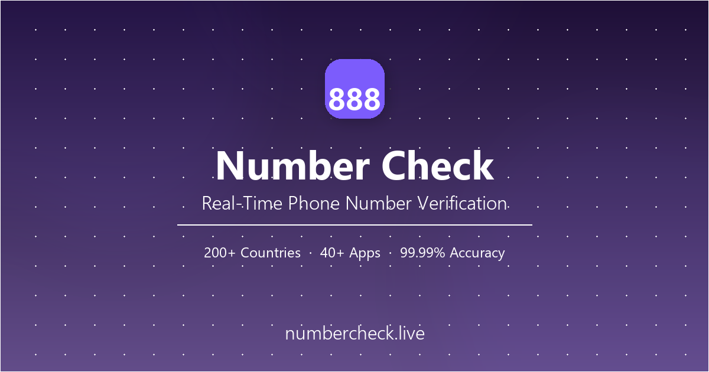

# Free Phone Number Checker — WhatsApp & Telegram Verification Online | 888 Number Check

  

  <a href="https://numbercheck.live"><strong>🔗 Free Online Tool</strong></a>
  &nbsp;•&nbsp;
  <a href="https://numbercheck.live/tools/whatsapp-number-checker.html"><strong>WhatsApp Checker</strong></a>
  &nbsp;•&nbsp;
  <a href="https://numbercheck.live/tools/telegram-number-checker.html"><strong>Telegram Checker</strong></a>
  &nbsp;•&nbsp;
  <a href="https://numbercheck.live/blog/"><strong>Guides</strong></a>
  &nbsp;•&nbsp;
  <a href="https://t.me/ayongzhanshen"><strong>Telegram Support</strong></a>

  
  
  
  
  

---

**888 Number Check** is a **free online phone number checker** that verifies if a phone number is registered on **WhatsApp, Telegram, Facebook, Instagram** and **40+ other apps** across **200+ countries**. Check numbers one by one or in bulk — no sign-up, no login, 100% free.

✅ **Live at:** [numbercheck.live](https://numbercheck.live)

---

## 🔍 Free Phone Number Verification Tools

All tools are free, instant, and require no registration:

| Tool | What It Does |
|------|-------------|
| **[WhatsApp Number Checker](https://numbercheck.live/tools/whatsapp-number-checker.html)** | Check if a phone number has WhatsApp. Verify registration status, detect business accounts, validate format. Free online tool. |
| **[Telegram Number Checker](https://numbercheck.live/tools/telegram-number-checker.html)** | Verify if a phone number is registered on Telegram. Check account status instantly. Supports bulk API verification. |
| **[Phone Number Format Checker](https://numbercheck.live/tools/phone-number-format-checker.html)** | Validate international phone number format, detect country & carrier, convert to E.164 standard. 200+ countries supported. |
| **[SMS Marketing ROI Calculator](https://numbercheck.live/tools/sms-roi-calculator.html)** | Calculate how much invalid & inactive phone numbers cost your SMS campaigns. Estimate list cleaning savings. |

---

## 📋 What You Can Do

| Feature | Description |
|---------|-------------|
| **Check WhatsApp Number Online** | Verify if any phone number is registered on WhatsApp — personal or business account. No adding contacts. |
| **Telegram Number Verification** | Check Telegram account registration status. Supports bulk lookup via API for marketing teams. |
| **Bulk Phone Number Validation** | Process 100K+ phone numbers in under 5 minutes. CSV upload, API batch processing, auto-sorted results. |
| **Cross-Platform Number Detection** | WhatsApp, Telegram, Facebook, Instagram, Binance, Amazon, TikTok, iOS/Android — 40+ apps coverage. |
| **International Phone Format Check** | E.164 format conversion, country code validation, carrier detection. 200+ countries, all carriers. |
| **SMS List Cleaning** | Remove duplicates, validate formats, detect inactive numbers. Save up to 30% on SMS campaign costs. |

---

## 📖 Phone Number Verification Guides — Free Blog

- **[How to Verify WhatsApp Numbers in Bulk — Complete 2026 Guide](https://numbercheck.live/blog/how-to-verify-whatsapp-numbers-in-bulk.html)** — Check 100K+ numbers in 5 minutes with 99% accuracy
- **[Phone Number Format Guide — 50+ Countries with Dialing Codes](https://numbercheck.live/blog/phone-number-format-guide-by-country.html)** — E.164 standards, digit lengths, examples
- **[How to Clean a Phone Number List for Marketing — 8-Step Guide](https://numbercheck.live/blog/how-to-clean-phone-number-list-marketing.html)** — Reduce bounce rates, improve deliverability
- **[Phone Number Verification API Integration Guide](https://numbercheck.live/blog/phone-number-verification-api-integration-guide.html)** — RESTful endpoints, SDK for Python/Node.js/PHP/Go
- **[International SMS Marketing Strategy Guide — 2026](https://numbercheck.live/blog/international-sms-marketing-guide.html)** — Regulations, carrier compliance, global campaigns
- **[Why Phone Numbers Go Inactive — Causes & Solutions](https://numbercheck.live/blog/why-phone-numbers-go-inactive.html)** — 20-30% go inactive yearly. Learn why and how to fix it.

---

## 🛠 Technical Stack

- **Frontend**: HTML5, CSS3, vanilla JavaScript — zero dependencies, instant load
- **Deployment**: GitHub Pages + custom domain `numbercheck.live`
- **CDN**: Cloudflare global edge caching
- **SEO**: JSON-LD structured data, Open Graph, Twitter Cards, XML sitemap (23 URLs), RSS feed, hreflang tags, IndexNow auto-submission
- **Analytics**: Google Analytics 4 + Google Search Console verified + Bing Webmaster verified

---

## 🚀 How to Use (No Sign-Up Required)

1. Go to [numbercheck.live](https://numbercheck.live)
2. Choose a tool: **WhatsApp Checker**, **Telegram Checker**, **Format Validator**, or **SMS ROI Calculator**
3. Enter a phone number in international format (e.g., `+12125550123`)
4. Get instant results — the number owner is NOT notified

For bulk verification, upload a CSV/TXT file or integrate via API. See the [API guide](https://numbercheck.live/blog/phone-number-verification-api-integration-guide.html).

---

## 🌍 Contact

- **Website**: [numbercheck.live](https://numbercheck.live)
- **Telegram**: [@ayongzhanshen](https://t.me/ayongzhanshen)
- **Facebook**: [888NumberCheck](https://www.facebook.com/888NumberCheck)

---

*Free phone number verification tool for marketers, developers, and sales teams. Check WhatsApp, Telegram, and 40+ apps. 200+ countries. Open source (MIT).*
